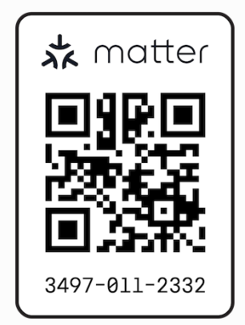

# ESP32 Testing
Used to test the Matter transport to see if a Matter endpoint receives the payload correctly.

Currently only supports ESP32-S3 DevKitC-1 v1.1 with the WROOM2 N32R16V. However, by changing the first of the if-elseif-statements "set" in the CMakeLists to your ESP32, it should use the sdkconfig that your ESP32.

Using ESP IDF 6.0.2 and ESP Matter 1.6.0 in a WSL environment. Some changes to the RPI might have to be made, such as enabling testing DCL to be true or something along those lines. It is not recommened to use the ESP32 extension for VSCode due to errors and the time it takes for the build process.

This is the QR code needed for commissioning. Manual pairing does not work or is unintuitive.

This example is exactly the same as the light example is esp-matter, except that it uses the ESP32s3.

## Current Issues
1. Pressing the reset button or holding the boot button for commissioning seems buggy. It is best to use the serial monitor and repeatedly close/open it for commissioning or for testing BLE.

## Current Progress (Wireless)
1. Creates the Matter endpoint
2. Has commissioning
3. Has different functionalites for the Matter device, such as turning in on, changing colors, etc.
4. State of the light is reflected quickly for both HA and the ESP32.

## To-do
### Operation with Wi-Fi (To be completed first)
1. Verify that commissioning works properly (must connect to Home Assistant)
2. Verify that endpoint can be seen
3. Verify that updating the main program doesn't ruin the commissioning if it is already done
4. Verify that features such as turning on/off light and changing colors work
5. Verify if the state change is reflected on the Home Assistant card

### Without Wi-Fi (WIRED)
1. Enable UART functionality
2. De-frame the custom frame of the IPv6 packets
3. Have Matter take in the de-framed packets
4. Go through all functionality tests (1-5) from Operation with Wi-Fi, except this time it is wired to the STM32 which is also wired to the RPI.

### Tests Completed
1. ESP32 can be commissioned and its LED can be changed by HA.